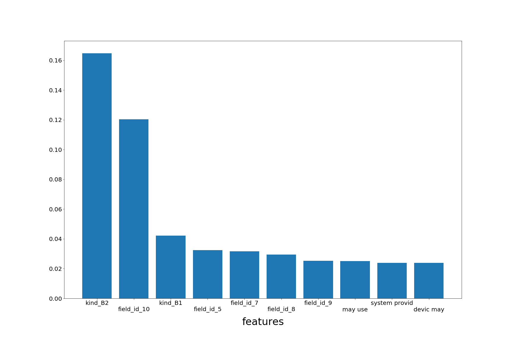

# Will your patent cost you?

Every business needs patents. Taking ownership of your creations and creation methods is a nessicary step in future profitability of any sucessful business. We all know that it costs a lot of money to file a patent but costs can continue later in a patents lifetime.

The creation of The Patent Trials and Appeals Board (PTAB) has allowed for easier and cheaper litigation for any claiment who wishes to challenege an exsisting patent. This puts pressure like never beore on companies small and large alike to be certain that the patents they file are not only capable of passing the process of being approved but also to make them iron clad to future challenges.

That is where this program comes in. By creating machine learning models a reliable assessment can be made of any filed patent determining the liklihood it will be called before PTAB.

## The Data: Obtaining, Wrangling and Cleaning

### Obtaining
Publicly available patent data can be obtained at https://www.patentsview.org/download/. The primary data set is labeled as patent as of the writing of this readme. Other datasets can also be downloaded here and their information added as columns to the data set to alter the model. Data experimened with included uspc, wipo and cpc_current.

The PTAB office has an API that can be used to obtain information on patents called before the board. On https://developer.uspto.gov/ptab-api/swagger-ui.html open the get proceedings section, in the field labeled proceedingTypeCategory input AIA and in the field labeled recordTotalQuantity input a number higher than the total number of AIA trials (11227 as of the writing of this readme) and click try it out. This will return all information on all AIA trials and can be copied into a file or database of your choice.

### Wrangling
The data is far too large to anaylize in a pandas dataframe even with the memory available on an AWS instance. The final solution was to read in patent data a piece at a time via chunksize and only a few years with of data at a time, label each row with a 1 or 0 based on their presence or absence in the ptab data and then save the information to seperate files. The ratio of 1 to 0 in this case is approximitly 1000:1, meaning we will need to undersample our data and the resulting dataset will be small enough to handle with available RAM. Functions to read in, seperate, and sample from this data are available in the src folder of this project.

### Cleaning
For the simplest models dummy variables are created for categorical features and non numeric features are removed. Features with null values include abstracts, which are set to empty strings and whether or not a patent was withdrawn, which was set to 0. Function for these processes are available in the src folder.

## EDA
The ratio of patents who go to AIA trials and those that do not is very close to 1:1000. 
seaborn two class displays
feature correlation
## Model Creation and testing
Created a Random Forest model as a baseline model to determine quality without feature engineer or Natural Language Processing (NLP). The most important result is that potentially contestable patents are identified so recall was used to compared model results. As the classes are highly imbalanced the focus will be on tree style models as they have very good results for unblanced situations.

Baseline random forest : recall 67%

## Models created with only the features present in the patent database
## (patent type, patent kind, number of claims, if a patent was withdrawn)

# oh no!
it seems the starting features can hardly produce results better than guessing the average. To improve upon this 
categories created by WIPO (world intellectual propery organization) are added as categorical features. In addition 
## Models created by added in wipo data and 

# hmm...
it seems that these results are good enough to be suspicious. According to the gradient boosting results we can predict with perfect accuracy. This suggests that there is a feature that highly correlates to the results. Below is a display of features of relative importance.
## Random Forest

## Gradient Boost

## XG Boost

We can see by looking at the top 10 feature importances that the top 2 are always num_claims and withdrawn: num_claims is the number of things a patent asserts are unique and of importance about a given patent, withdrawn is if a granted patent was withdrawn or not.

It makes sense that num_claims would be important since if a patent makes more claims it opens itself to more opportunities to be disputed. However it might not be useful for a company to hear that their patents shouldn't cover very many features because it makes challenging them easier.

Withdrawn is of greater concern because it may actually be a source of data leakage. A company might withdraw a patent because they had been challenged or because the patent had been gratned but was somehow flawed.

Given these considerations it is best to remove those two features and rerun the models for new results.
## Models created without number of claims or withdrawn

## top 10 Relevent features for dataset without claims or withdrawn status

## Random Forest

## Gradient Boost

## XG Boost

## Conclusions
The most relvent features in the final version were consistently field_id_10, which is the WIPO category for measurement instruments and kind_b1 which is a category for patents that do not have a perviously published pre-grant publication. This leaves us with the interesting conclusion that patents that are for measuring devices but that have not been previously published before being patented are the strongest indicators of whether or not a patent is likely to be called before PTAB for a trial. 

The two largest drawback to this program are lack of including full text information on the patents and the lack of data on federal court hearings of patents. The first can be resulved by increasing hardware capabilities or carefully parsing full text data one part at a time. The later requires more research into available public data on patent trials.

Recall corllates strongly with number of claims. This follows logically, if a patent makes several claims that opens them up to more areas on which they can be challenged. This does not mean the program is perfect, future directions explains in more detail ways this project could be advanced.

## Recreation
Code experimentation was carried out inside jupyter notebook files, Data can be obtained as described above, all functions are in pyfiles inside the src folder and all images produced are inside the img folder. To start the project over from scratch simply obtain the data as described in this readme, place it inside the data folder and execute py file patenttrialpredicter. WARNING, you may experience out of memory errors and or the cleaning and modeling may take a very long time.

## Future Directions

More sofiticated user interface.
Federal court trials of patents data could be added to database to make the predictive model inclusive to all trials.
Non US patent data could be cross-checked.
LDA analysis of the full text of patents would provide new features that might be instructive to the preditive model.
One class classification could be created and results compared to current model.
LSTM network could be compared to current model.
Investigate method to cobtain size of company information to add as a feature to future models.